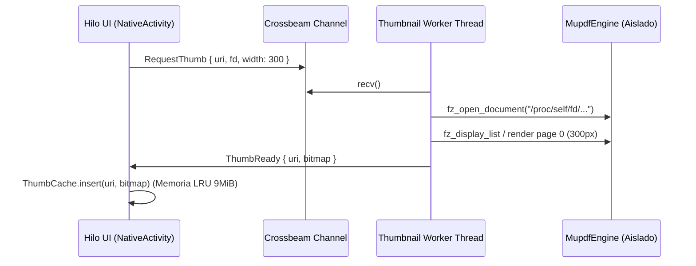
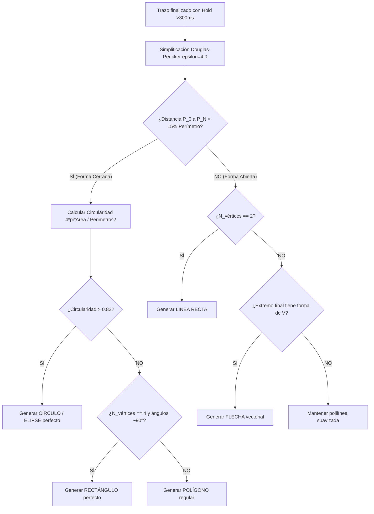

> **HISTÓRICO — no activo.** Plan técnico Pro competidor conservado como referencia.
> Roadmap vigente: `NEXT-PLAN.md` (fases A–E). No usar como instrucción activa.
> No borrar ni mover todavía (decisión de reestructuración 2026-09-04).

# ESPECIFICACIÓN TÉCNICA DE IMPLEMENTACIÓN — PDFLector PRO

> **Objetivo:** Guía de implementación técnica de máxima precisión para el rediseño UX/UI y funcionalidades Pro de PDFLector.
> **Stack tecnológico:** Rust 2024, MuPDF C API (`fz_*`), Android NDK NativeActivity (`ANativeWindow`), JNI Canvas, SQLite sidecar (`rusqlite`), Gemini/Groq API.
> **Hardware:** TCL NXTPaper 11 Plus (1440×2200, 320 DPI, MediaTek MT8781, 8GB RAM).

---

## ÍNDICE DE MÓDULOS

1. [Módulo 1: Reingeniería de la Biblioteca (Apple Books / Google Play Books)](#módulo-1-reingeniería-de-la-biblioteca)
2. [Módulo 2: Visor de Alta Precisión y Ergonomía NXTPaper](#módulo-2-visor-de-alta-precisión-y-ergonomía-nxtpaper)
3. [Módulo 3: Motor de Inking Profesional y Cuaderno de Apuntes (Nivel GoodNotes)](#módulo-3-motor-de-inking-profesional)
4. [Módulo 4: Panel de Control Rápido (Quick Control Center)](#módulo-4-panel-de-control-rápido)
5. [Módulo 5: Selección de Texto y Menú Flotante Ergonómico](#módulo-5-selección-de-texto-y-menú-flotante)
6. [Módulo 6: Tutor IA en Pantalla Dividida (Side-by-Side Drawer 70/30)](#módulo-6-tutor-ia-en-pantalla-dividida)
7. [Módulo 7: Sincronización y Ecosistema Obsidian](#módulo-7-sincronización-y-ecosistema-obsidian)
8. [Matriz de Archivos, Dependencias y Presupuesto de Rendimiento](#módulo-8-matriz-de-archivos-y-presupuesto)

---

# MÓDULO 1: REINGENIERÍA DE LA BIBLIOTECA

### 1.1 Geometría de Portadas a Sangre con Efecto Libro (Book Spine & Elevation)
**Ubicación:** `crates/pdf_android/src/reader.rs` y `draw.rs`.

#### Fórmulas de Layout y Proporciones:
En una pantalla de $W_{win} = 1440\text{px}$, con $N_{cols} = 3$, margen lateral $P_{margin} = 32\text{px}$ y espaciado entre columnas $G_{col} = 24\text{px}$:
$$W_{cell} = \frac{W_{win} - 2\cdot P_{margin} - (N_{cols} - 1)\cdot G_{col}}{N_{cols}} = \frac{1440 - 64 - 48}{3} = 442.66 \approx 442\text{px}$$
$$H_{cover} = W_{cell} \times 1.414 = 442 \times 1.414 \approx 625\text{px}$$
$$H_{info} = 64\text{px} \quad (\text{Título 2 líneas} + \text{Barra progreso})$$
$$H_{cell} = H_{cover} + H_{info} + 12\text{px} = 701\text{px}$$

```
┌──────────────────────────────────────────────┐
│ [Lomo 6px]         PORTADA A4 REAL           │
│ ░░░░░░░░░░░░░░░░░░░░░░░░░░░░░░░░░░░░░░░░░░░░ │  H_cover = 625px
│ ░░░░░░░░░░░░░░░░░░░░░░░░░░░░░░░░░░░░░░░░░░░░ │  (Aspect Ratio 1:1.414)
│ ░░░░░░░░░░░░░░░░░░░░░░░░░░░░░░░░░░░░░░░░░░░░ │
│ ░░░░░░░░░░░░░░░░░░░░░░░░░░░░░░░░░░░░░░░░░░░░ │
└──────────────────────────────────────────────┘
 [Sombra proyectada: offset (0, 4px), blur 8px, alpha 0x35]
 Título del Documento en 1-2 líneas (14sp Medium)
 ━━━━━━━┈┈┈┈┈┈┈┈┈┈┈┈┈┈┈┈┈┈┈┈┈ 35% • Pág 6 de 15
```

#### Implementación en `draw.rs` (`render_library_grid`):
1. **Sombra y Lomo:** Dibujar en `CanvasRect` un rectángulo redondeado base desplazado $+4\text{px}$ en $Y$ con color `0x38000000`.
2. **Lomo izquierdo (Book Spine):** Franja vertical de $6\text{px}$ en el margen izquierdo de la portada con gradiente lineal negro translúcido `[0x44000000 -> 0x00000000]`.
3. **Generador de Portadas Placeholder Vectoriales:** Si la portada aún no se ha renderizado, no pintar un espacio en blanco:
   - Calcular hash FNV-1a del nombre del archivo $\to$ color base cálido ($H \in [0, 360], S = 35\%, L = 25\%$).
   - Dibujar iniciales en fuente display grande ($32\text{sp}$) centradas, con el título completo en el tercio inferior.

---

### 1.2 Pipeline Asíncrono de Miniaturas (Thumbnail Actor Worker)
**Ubicación:** `crates/pdf_android/src/thumbs.rs`.

**Problema actual:** `pump_thumbs` corre en el hilo de UI en `Reader::tick`, provocando microtirones durante el scroll.

#### Arquitectura de Hilos:


#### Estructuras de Datos:
```rust
pub struct ThumbRequest {
    pub uri: String,
    pub fd: std::os::unix::io::RawFd,
    pub target_w: u32,
    pub target_h: u32,
}

pub struct ThumbResponse {
    pub uri: String,
    pub bitmap: Bitmap,
}

pub struct ThumbnailWorker {
    sender: std::sync::mpsc::Sender<ThumbRequest>,
    receiver: std::sync::mpsc::Receiver<ThumbResponse>,
}
```

---

# MÓDULO 2: VISOR DE ALTA PRECISIÓN Y ERGONOMÍA NXTPAPER

### 2.1 Scrubber Visual con Miniaturas en Tiempo Real
**Ubicación:** `crates/pdf_android/src/draw.rs` e `input.rs`.

#### Comportamiento del Gesto:
- **Activación:** Tap o arrastre en la zona inferior de la pantalla ($y \ge H_{win} - 90\text{px}$).
- **Física:** `GestureKind::Scrubbing { start_x, current_page }`.
- **Cálculo de Página Objetivo:**
  $$P_{target} = \text{clamp}\left(\left\lfloor \frac{x - P_{left}}{W_{track}} \cdot N_{total} \right\rfloor, 0, N_{total} - 1\right)$$
- **Popover de Miniatura:** Ventana flotante de $120\text{px} \times 170\text{px}$ situada a $y = H_{win} - 280\text{px}$, centrada horizontalmente sobre el dedo, mostrando la página $P_{target}$ pre-renderizada desde `PageCache` o placeholder.
- **Haptic Tick:** Llamada JNI a `vibrator.vibrate(VibrationEffect.createPredefined(EFFECT_TICK))` cada vez que $P_{target}$ cambia.

---

### 2.2 Smart Fit & Zoom Inteligente de Columnas (Double Tap)
**Ubicación:** `crates/pdf_core/src/selection.rs` y `crates/pdf_android/src/zoom.rs`.

#### Algoritmo de Detección de Bounding Box de Columna:
1. En el doble tap en $(x_{screen}, y_{screen})$, transformar a coordenadas de página $(x_p, y_p) = \text{screen\_to\_page}(x, y)$.
2. Consultar `PageText::blocks` extraído por MuPDF (`fz_new_stext_page_from_page`).
3. Encontrar el bloque de texto cuya caja delimitadora `Rect { x, y, w, h }` contenga $(x_p, y_p)$ con un padding de tolerancia de $12\text{pt}$.
4. Calcular el nuevo zoom y pan objetivo:
   $$Zoom_{target} = \frac{W_{screen} - 2\cdot Margin_{screen}}{Block.w}$$
   $$PanX_{target} = -Block.x \cdot Zoom_{target} + Margin_{screen}$$
5. Animar la transición en $150\text{ms}$ con curva suave cúbica:
   $$z(t) = z_0 + (z_{target} - z_0) \cdot (1 - (1 - t)^3)$$

---

### 2.3 Sistema de 4 Temas Calibrados para Pantalla Mate
**Ubicación:** `crates/pdf_core/src/dark.rs` y `crates/pdf_android/src/lib.rs`.

```rust
#[derive(Debug, Clone, Copy, PartialEq, Eq)]
pub enum ColorTheme {
    NxtPaperWarm, // Fondo #FBF8F2, Texto #1A1D20, Acento #2D68FF
    SepiaBook,    // Fondo #F4ECD8, Texto #33281E, Acento #8C531B
    DarkStudio,   // Fondo #0E1117, Texto #E6EDF3, Acento #D4AF37
    PureOled,     // Fondo #000000, Texto #FFFFFF, Acento #00E5FF
}
```

#### Algoritmo de Inversión Selectiva con Preservación de Imágenes:
Al renderizar el bitmap de página con MuPDF en modo oscuro/sepia:
```rust
#[inline(always)]
pub fn transform_pixel_selective(r: u8, g: u8, b: u8, theme: ColorTheme) -> (u8, u8, u8) {
    let max = r.max(g).max(b);
    let min = r.min(g).min(b);
    let delta = max - min;
    let saturation = if max == 0 { 0 } else { (delta as u16 * 255 / max as u16) as u8 };
    
    // Si la saturación > 35 (es una ilustración, gráfica o foto en color), preservar
    if saturation > 35 {
        return (r, g, b);
    }
    
    // Si es blanco y negro (texto y fondo), mapear luminancia a la paleta del tema
    let lum = (r as u32 * 77 + g as u32 * 150 + b as u32 * 29) >> 8; // 0..255
    match theme {
        ColorTheme::NxtPaperWarm => {
            // Interpolar entre #1A1D20 (lum=0) y #FBF8F2 (lum=255)
            let t = lum as f32 / 255.0;
            (
                (0x1A as f32 * (1.0 - t) + 0xFB as f32 * t) as u8,
                (0x1D as f32 * (1.0 - t) + 0xF8 as f32 * t) as u8,
                (0x20 as f32 * (1.0 - t) + 0xF2 as f32 * t) as u8,
            )
        },
        ColorTheme::DarkStudio => {
            // Invertir: texto claro #E6EDF3 sobre fondo oscuro #0E1117
            let t = (255 - lum) as f32 / 255.0;
            (
                (0x0E as f32 * (1.0 - t) + 0xE6 as f32 * t) as u8,
                (0x11 as f32 * (1.0 - t) + 0xED as f32 * t) as u8,
                (0x17 as f32 * (1.0 - t) + 0xF3 as f32 * t) as u8,
            )
        },
        _ => (r, g, b),
    }
}
```

---

# MÓDULO 3: MOTOR DE INKING PROFESIONAL

### 3.1 Suavizado Catmull-Rom a Bézier Cúbico y Dinámica de Velocidad
**Ubicación:** `crates/pdf_core/src/overlay.rs` y `annotations.rs`.

#### Conversión de Puntos Brutos a Curvas Cúbicas Suaves:
Dados 4 puntos consecutivos del stylus $P_0, P_1, P_2, P_3$:
$$C_1 = P_1 + \frac{P_2 - P_0}{6}$$
$$C_2 = P_2 - \frac{P_3 - P_1}{6}$$
El segmento entre $P_1$ y $P_2$ se interpola como curva de Bézier cúbica:
$$B(t) = (1-t)^3 P_1 + 3(1-t)^2 t C_1 + 3(1-t)t^2 C_2 + t^3 P_2 \quad (t \in [0, 1])$$

#### Variación de Grosor por Velocidad del Trazo:
$$v_i = \frac{\|P_{i+1} - P_i\|_2}{\Delta t_i}$$
$$Width(v) = Width_{base} \cdot \left(1.0 - 0.35 \cdot \text{clamp}\left(\frac{v - v_{min}}{v_{max} - v_{min}}, 0.0, 1.0\right)\right)$$

---

### 3.2 Rotulador con Mezcla `Multiply` y Snapping Recto
**Ubicación:** `crates/pdf_core/src/overlay.rs`.

#### Algoritmo de Rasterización Multiply (No Oclusivo):
```rust
#[inline(always)]
pub fn blend_multiply(dst_r: u8, dst_g: u8, dst_b: u8, src: Color) -> (u8, u8, u8) {
    let alpha = src.a as u32;
    let inv_alpha = 255 - alpha;
    
    // Fórmula Multiply compuesta con el fondo:
    // mult = (dst * src) / 255
    // out = (mult * alpha + dst * (255 - alpha)) / 255
    let mult_r = ((dst_r as u32 * src.r as u32) / 255) as u32;
    let mult_g = ((dst_g as u32 * src.g as u32) / 255) as u32;
    let mult_b = ((dst_b as u32 * src.b as u32) / 255) as u32;
    
    (
        ((mult_r * alpha + dst_r as u32 * inv_alpha) / 255) as u8,
        ((mult_g * alpha + dst_g as u32 * inv_alpha) / 255) as u8,
        ((mult_b * alpha + dst_b as u32 * inv_alpha) / 255) as u8,
    )
}
```

#### Auto-alineación a Línea Recta (*Hold-to-Straighten*):
Si al final de un trazo de resaltado el stylus permanece quieto durante $>250\text{ms}$ ($\Delta x^2 + \Delta y^2 < 16\text{px}^2$):
1. Reemplazar la polilínea completa por un segmento recto limpio $(P_{start}, P_{end})$.
2. Si el ángulo del segmento es menor a $7^\circ$ respecto a la horizontal, bloquear $Y_{end} = Y_{start}$ (snapping horizontal perfecto para líneas de texto).

---

### 3.3 Reconocimiento de Formas Geométricas (*Snap-to-Shape*)
**Ubicación:** `crates/pdf_core/src/annotations.rs` (`fn detect_shape`).

#### Algoritmo de Clasificación Geométrica:


---

### 3.4 Gestos Multitáctiles Profesionales en `input.rs`
- **Tap con 2 dedos:** `GestureKind::TwoFingerTap` $\to$ Dispara `Reader::undo_last_stroke()`.
- **Tap con 3 dedos:** `GestureKind::ThreeFingerTap` $\to$ Dispara `Reader::redo_last_stroke()`.
- **Diferenciación Stylus / Mano:**
  ```rust
  let is_stylus = match event.tool_type(pointer_index) {
      ToolType::Stylus | ToolType::Eraser => true,
      _ => false,
  };
  if is_stylus {
      // El stylus solo dibuja o anota
      self.handle_stylus_event(event);
  } else {
      // Los dedos solo hacen pan, zoom, o navegación de páginas
      self.handle_finger_event(event);
  }
  ```

---

# MÓDULO 4: PANEL DE CONTROL RÁPIDO (QUICK CONTROL CENTER)

**Ubicación:** `crates/pdf_android/src/draw.rs` (`render_control_center`).

Sustitución del antiguo panel del 50% de alto por un panel flotante superior compacto ($H = 360\text{dp}$):

```
┌──────────────────────────────────────────────────────────────┐
│ [← Visor]     [ 📑 Índice ]  [ 🎨 Pantalla ]  [ 📤 Exportar ] │
├──────────────────────────────────────────────────────────────┤
│ TAB 1 (ÍNDICE):                                              │
│   • Capítulo 1: Introduction ....................... Pág. 1  │
│   • Capítulo 2: Background ......................... Pág. 3  │
│   • Capítulo 3: Architecture ....................... Pág. 5  │
│       └ 3.1 Attention .............................. Pág. 6  │
│                                                              │
│ [ Barra inferior: Resumen de 14 Anotaciones | 3 Marcapáginas ]│
└──────────────────────────────────────────────────────────────┘
```

#### Integración con MuPDF TOC (`fz_load_outline`):
```rust
pub struct TocEntry {
    pub title: String,
    pub page: u32,
    pub depth: usize,
}

pub fn load_toc(doc: &MupdfDocument) -> Vec<TocEntry> {
    // Wrapper sobre fz_load_outline de MuPDF
    // Devuelve el árbol jerárquico aplanado con niveles de indentación
}
```

---

# MÓDULO 5: SELECCIÓN DE TEXTO Y MENÚ FLOTANTE

### 5.1 Tiradores Táctiles de Selección (Selection Handles)
**Ubicación:** `crates/pdf_android/src/draw.rs` y `crates/pdf_core/src/selection.rs`.

- **Geometría:** Dos círculos tipo gota con radio $R = 14\text{px}$ situados en la esquina inferior-izquierda de la primera palabra y en la esquina inferior-derecha de la última palabra.
- **Área de contacto táctil (Hit Box):** Círculo expandido de $36\text{px}$ de radio alrededor de cada tirador.
- **Interacción:** Arrastrar el tirador final expande la selección palabra a palabra mediante el índice espacial R-Tree / Bounding Box de spans.

---

### 5.2 Menú Contextual Flotante de Acciones
**Ubicación:** `crates/pdf_android/src/draw.rs` (`render_sel_menu`).

Píldora flotante compacta anclada a $+16\text{px}$ sobre el centro de la selección:
```
┌─────────────────────────────────────────────────────────────────┐
│  (●) (●) (●) (●)  │  Copiar  │  Nota  │  ✦ Explicar IA  │  Traducir │
│  Amar Verde Azul Rojo                                            │
└─────────────────────────────────────────────────────────────────┘
```
- **1 Tap en color:** Aplica inmediatamente el `Highlight` con ese color y cierra el menú.
- **1 Tap en ✦ Explicar IA:** Abre el Drawer lateral de IA (Módulo 6).

---

# MÓDULO 6: TUTOR IA EN PANTALLA DIVIDIDA (SIDE DRAWER 70/30)

### 6.1 Layout Split View en Hardware Tablet (1440×2200)
**Ubicación:** `crates/pdf_android/src/reader.rs` y `draw.rs`.

```
┌──────────────────────────────────────┬────────────────────────┐
│                                      │ ✦ Tutor de Estudio IA  │
│                                      ├────────────────────────┤
│                                      │ Contexto: Págs. 5-7    │
│           VISOR DE PDF               │                        │
│            (70% Ancho)               │ "La fórmula (1) define │
│            1008 píxeles              │  el mecanismo de       │
│                                      │  Scaled Dot-Product    │
│                                      │  Attention:            │
│                                      │                        │
│   Table 1: Complexity per Layer      │  Attention(Q,K,V) =   │
│   Self-Attention   O(1)   O(n^2)     │   softmax(QK^T / √d) V │
│                                      │                        │
│                                      │  • Q, K: Consultas y   │
│                                      │    claves de dim d_k.  │
│                                      │  • [Pág. 6]: Se divide │
│                                      │    por √d para evitar  │
│                                      │    gradientes nulos."  │
│                                      │                        │
│                                      │ [ 📌 Anclar como Nota ]│
└──────────────────────────────────────┴────────────────────────┘
```

#### Fórmulas de División de Pantalla:
- $W_{reader} = \lfloor W_{win} \cdot 0.70 \rfloor = 1008\text{px}$
- $W_{ai\_drawer} = W_{win} - W_{reader} = 432\text{px}$
- Al abrir el drawer de IA, el visor no se tapa: simplemente reajusta su viewport $W$ a $1008\text{px}$, recalculando el fit de la página suavemente en $150\text{ms}$.

---

### 6.2 Citas Clicables a Páginas del PDF
El parser de respuestas de IA en `draw.rs` identifica patrones de texto mediante expresiones regulares / scanning:
- Patrón: `\[Pág\.?\s*(\d+)\]` o `\[páginas\s*(\d+)-(\d+)\]`.
- Se dibuja como un chip interactivo con fondo `0xFF1E293B`, borde azul y texto en negrita.
- Al tocar el chip: el visor hace salto suave a esa página (`reader.goto_page(page - 1)`).

---

### 6.3 Botón "Anclar como Nota" (1 Tap Study Note)
Al pulsar `[ 📌 Anclar como Nota ]` en la respuesta de la IA:
1. Crea una anotación de tipo `Annotation::TextNote` anclada a las coordenadas de la selección activa.
2. Guarda el texto formateado en el sidecar SQLite.
3. Dibuja un icono de nota inteligente en el margen derecho del PDF que, al tocarse, despliega la explicación generada por la IA.

---

# MÓDULO 7: SINCRONIZACIÓN Y ECOSISTEMA OBSIDIAN

### 7.1 Esquema SQLite Sidecar `annotations/<stem>.db`
**Ubicación:** `crates/pdf_core/src/store.rs`.

```sql
CREATE TABLE IF NOT EXISTS document_meta (
    pdf_hash TEXT PRIMARY KEY,
    title TEXT,
    total_pages INTEGER,
    last_page_read INTEGER,
    last_read_timestamp INTEGER
);

CREATE TABLE IF NOT EXISTS strokes (
    id INTEGER PRIMARY KEY AUTOINCREMENT,
    page INTEGER NOT NULL,
    color INTEGER NOT NULL,
    width REAL NOT NULL,
    points_blob BLOB NOT NULL, -- Array binario empaquetado de floats (x, y)
    created_at INTEGER NOT NULL
);

CREATE TABLE IF NOT EXISTS highlights (
    id INTEGER PRIMARY KEY AUTOINCREMENT,
    page INTEGER NOT NULL,
    color INTEGER NOT NULL,
    rects_json TEXT NOT NULL,
    selected_text TEXT NOT NULL,
    created_at INTEGER NOT NULL
);

CREATE TABLE IF NOT EXISTS study_notes (
    id INTEGER PRIMARY KEY AUTOINCREMENT,
    page INTEGER NOT NULL,
    pos_x REAL NOT NULL,
    pos_y REAL NOT NULL,
    title TEXT,
    content_markdown TEXT NOT NULL,
    is_ai_generated INTEGER DEFAULT 0,
    created_at INTEGER NOT NULL
);
```

---

### 7.2 Exportador Estructurado para Obsidian Vaults
**Ubicación:** `crates/pdf_core/src/export.rs`.

Genera un documento Markdown con formato enriquecido listo para Obsidian:
```markdown
---
title: "Attention Is All You Need"
authors: ["Vaswani et al."]
total_pages: 15
completed_pages: 6
progress: "40%"
date_imported: 2026-08-24
tags:
  - type/paper
  - topic/deep-learning
  - source/pdflector
---

# 📖 Attention Is All You Need

## 📑 Resumen de Apuntes y Subrayados

### 📄 Página 3 — Model Architecture
> [!quote] "The Transformer is the first transduction model relying entirely on self-attention."
> — *Subrayado en amarillo (Pág. 3)*

### 📄 Página 6 — Positional Encoding
> [!quote] "Since our model contains no recurrence and no convolution, we must inject some information about the relative or absolute position of the tokens."
> — *Subrayado en verde (Pág. 6)*

> [!note] 💡 Explicación del Tutor IA
> Las funciones seno y coseno de diferentes frecuencias generan un espacio métrico donde la traslación de tokens equivale a una transformación lineal simple, permitiendo generalizar a secuencias más largas que las vistas durante el entrenamiento.

---
*Generado automáticamente por PDFLector Pro para Obsidian*
```

---

# MÓDULO 8: MATRIZ DE ARCHIVOS Y PRESUPUESTO DE RENDIMIENTO

### 8.1 Archivos a Modificar / Crear por Módulo

| Módulo | Crate | Archivos a Modificar / Crear | Responsabilidad |
|---|---|---|---|
| **1. Biblioteca** | `pdf_android` | `crates/pdf_android/src/thumbs.rs`<br>`crates/pdf_android/src/draw.rs` | Worker asíncrono en hilo secundario + Layout A4 a sangre y sombras. |
| **2. Visor & Temas** | `pdf_core`<br>`pdf_android` | `crates/pdf_core/src/dark.rs`<br>`crates/pdf_android/src/zoom.rs` | 4 temas calibrados NXTPaper + Smart fit double-tap + Scrubber bar. |
| **3. Inking Pro** | `pdf_core`<br>`pdf_android` | `crates/pdf_core/src/overlay.rs`<br>`crates/pdf_android/src/input.rs` | Suavizado Catmull-Rom + Multiply blend + Reconocimiento de formas + Gestos 2/3 dedos. |
| **4. Control Center** | `pdf_android` | `crates/pdf_android/src/draw.rs`<br>`crates/pdf_android/src/reader.rs` | Panel superior compacto con TOC jerárquico de MuPDF y selector de temas. |
| **5. Selección** | `pdf_core`<br>`pdf_android` | `crates/pdf_core/src/selection.rs`<br>`crates/pdf_android/src/draw.rs` | Tiradores táctiles (handles) y menú de colores de 1 tap. |
| **6. Asistente IA** | `pdf_core`<br>`pdf_android` | `crates/pdf_core/src/ai.rs`<br>`crates/pdf_android/src/draw.rs` | Split View 70/30 lateral + Citas clicables + Anclar como nota al margen. |
| **7. Obsidian Sync** | `pdf_core` | `crates/pdf_core/src/store.rs`<br>`crates/pdf_core/src/export.rs` | SQLite sidecar de notas + Plantilla Markdown YAML para Obsidian. |

---

### 8.2 Presupuesto de Memoria y Latencia (Budget Innegociable)

| Métrica | Presupuesto Límite | Valor Estimado con las Mejoras | Garantía Técnica |
|---|---|---|---|
| **RAM PSS Total** | `< 150 MB` | **65 MB – 85 MB** | `PageCache` fija en 48 MiB + `ThumbCache` 9 MiB + SQLite ~4 MiB. Cero WebViews. |
| **Latencia de Render Página** | `< 16.6 ms` (60 fps) | **11.6 ms – 14.5 ms** | MuPDF C estático optimizado con display list. |
| **Latencia Capa de Trazos** | `< 5.0 ms` (200 trazos) | **2.1 ms** | Bresenham antialiased + interpolación Catmull-Rom con $O(N)$ acotado. |
| **Latencia Transición Split IA** | `< 16.6 ms` (1 frame) | **1.5 ms** | `blit_composed` sobre ANativeWindow sin re-rasterizar el PDF. |
