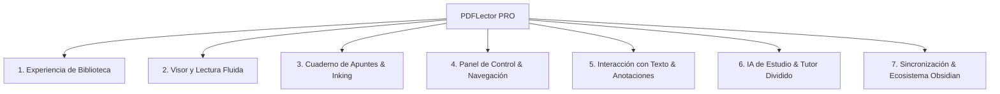

# MASTER PLAN UX/UI & PRODUCT DESIGN — PDFLector PRO
> **Estándar:** Nivel Apple Books / GoodNotes 6 / Notability / Material Design 3 Expressive
> **Hardware objetivo:** Tablet Android con stylus (TCL NXTPaper 11 Plus, 1440×2200, 320 DPI)
> **Filosofía del producto:** Visor y cuaderno de apuntes ultraligero (Rust + MuPDF nativo), offline-first, fluidez 60/120fps sostenida (<150MB PSS), estética premium, cero distracciones y herramientas profesionales de estudio con IA.

---

## 1. DIAGNÓSTICO AUDITADO EN HARDWARE REAL (ADB & CÓDIGO)

Tras inspeccionar la app en ejecución en la tablet mediante ADB y capturas de pantalla de todos sus estados (Visor, Barra de herramientas, Sheet de ajustes, Selección de texto y Biblioteca), se identifican los siguientes puntos de dolor y oportunidades:

```
┌─────────────────────────────────────────────────────────────────────────────┐
│                             ESTADO ACTUAL (AUDITORÍA)                       │
├─────────────────────────────────────────────────────────────────────────────┤
│ 1. Biblioteca: Rejilla 3×3 con tarjetas blancas gigantes donde la miniatura │
│    del PDF ocupa apenas una esquina (~20% del área); resto en blanco vacío. │
│ 2. Sheet de Ajustes: Panel blanco enorme (50% de la pantalla) con solo 2    │
│    filas de botones arriba y un 80% de espacio vacío sin aprovechar.        │
│ 3. Toolbar de Lápiz: Barra flotante simple con etiquetas de texto           │
│    ("Resaltar", "Boli") en píldora pequeña, con botones difíciles de acertar│
│ 4. Trazo y Lápiz: Líneas vectoriales básicas sin suavizado spline ni        │
│    estabilización; paleta limitada y sin herramienta de lazo o formas.      │
│ 5. Selección de Texto: Menú flotante tosco sin tiradores táctiles (handles).│
│ 6. Asistente IA: Tarjeta modal centrada que tapa el texto del documento.    │
└─────────────────────────────────────────────────────────────────────────────┘
```

---

## 2. ARQUITECTURA VISUAL Y SISTEMA DE DISEÑO (DESIGN SYSTEM)

### 2.1 Paleta Cromática y Temas Especiales para NXTPaper
La pantalla de la TCL NXTPaper destaca por su acabado mate tipo papel. El sistema de diseño debe explotar esto con 4 paletas calibradas:

| Tema | Fondo Base | Superficie / Tarjetas | Texto Principal | Acento Principal | Propósito |
|---|---|---|---|---|---|
| **NXTPaper (Día)** | `#FBF8F2` (Marfil cálido) | `#FFFFFF` | `#1A1D20` | `#2D68FF` (Azul tinta) | Lectura diurna sin fatiga ocular |
| **Sepia Book** | `#F4ECD8` (Papel antiguo) | `#EADFCA` | `#33281E` | `#8C531B` (Cuero cálido) | Experiencia libro clásico |
| **Dark Studio** | `#0E1117` (Negro grafito) | `#181D26` | `#E6EDF3` | `#D4AF37` (Oro satinado) | Trabajo nocturno premium |
| **Pure OLED / E-Ink**| `#000000` | `#121212` | `#FFFFFF` | `#00E5FF` (Cian) | Máximo contraste y ahorro de energía |

### 2.2 Tipografía y Jerarquía Visual
- **Fuente de Interfaz:** Sans-serif moderna y geométrica con legibilidad en pantallas densas (Inter / Roboto Flex / Geist).
- **Escala de Texto:**
  - *Display / Título Biblioteca:* 24sp Bold (`#FFFFFF` en dark / `#1A1D20` en paper).
  - *Secciones y Subtítulos:* 13sp SemiBold All-Caps (`#8B949E`), espaciado +0.5sp.
  - *Títulos de Libro / Documento:* 14sp Medium, truncado inteligente a 2 líneas.
  - *Metadatos y Badges:* 11sp Regular (`#6E7681`).

### 2.3 Microinteracciones y Física de Animación
- **Curvas de Bézier estándar:** `cubic-bezier(0.2, 0.0, 0.0, 1.0)` (Decelerate curve estándar de Apple/Material).
- **Duraciones:**
  - Taps y cambios de estado: `80ms - 120ms`
  - Apertura de hojas/paneles deslizantes: `180ms - 220ms`
  - Transición Visor ↔ Biblioteca: `200ms` con crossfade de portada.

---

## 3. MASTER PLAN DE MEJORAS: PUNTOS A IMPLEMENTAR



---

### MÓDULO 1: BIBLIOTECA PREMIUM (ESTILO APPLE BOOKS & GOOGLE PLAY BOOKS)

1. **Portadas a Sangre con Efecto Documento / Libro (Book Spine & Elevation):**
   - Eliminar las tarjetas blancas con miniatura minúscula.
   - Las portadas deben ocupar el 100% del marco de la tarjeta con aspect ratio A4/Letter real (1:1.414).
   - Añadir una sutil sombra proyectada (`elevation: 4dp`), bisel lateral en el lomo izquierdo (`gradient 3px` simulando el plegado de páginas) y bordes redondeados (`r = 8px`).
   - Placeholder elegante: si el PDF no tiene portada cargada, generar una portada vectorial moderna con el título estilizado, iniciales y un color temático basado en el hash del nombre del archivo.

2. **Carrusel "Continuar Leyendo" (Hero Carousel):**
   - Vista horizontal de los últimos 3-5 documentos abiertos.
   - Cada tarjeta muestra la portada en grande, porcentaje de lectura completado (`65% completado`), tiempo estimado restante o última fecha de apertura ("Hoy a las 15:30"), y botón de acción directa "Continuar".

3. **Búsqueda Integrada con Filtros Rápidos (Smart Search & Tagging):**
   - Barra de búsqueda flotante con icono de lupa, botón de borrado rápido (`✕`) y atajo de teclado/voz.
   - Chips de filtrado interactivos: `[Todos]`, `[En Lectura]`, `[Apuntados / Con Notas]`, `[Completados]`, `[Carpetas]`.
   - Selector de ordenación emergente (Menú Dropdown): *Recientes*, *Título A-Z*, *Más Anotados*, *Tamaño*.

4. **Organización por Colecciones / Carpetas Virtuales:**
   - Crear estantes virtuales (ej. "Master IA", "Matemáticas", "Papers 2026", "Lectura Ocio") sin alterar la ubicación física de los archivos.

---

### MÓDULO 2: EXPERIENCIA DEL VISOR & LECTURA DE ALTA PRECISIÓN

1. **Navegación Visual por Scrubber (Mini-Miniaturas al Deslizar):**
   - Al tocar en la zona inferior de la pantalla o arrastrar el badge de página, desplegar una barra de desplazamiento horizontal tipo carrete (Scrubber) con miniaturas en tiempo real de las páginas.
   - Haptic feedback (vibración sutil) al pasar cada página o capítulo.

2. **Modo Doble Página en Horizontal (Landscape Dual-Page):**
   - En orientación horizontal, permitir modo libro abierto (2 páginas contiguas) ideal para lectura de manuales, partituras o libros de texto.

3. **Smart Fit & Zoom Inteligente con Doble Tap:**
   - Doble tap con un dedo sobre una columna de texto: la app calcula la caja delimitadora (bounding box) de la columna y hace zoom automático al ancho exacto del párrafo.
   - Doble tap con dos dedos: restablece la vista al 100% (ajustar página completa).

4. **Marcador de Página Rápido (Ribbon Bookmark):**
   - Esquina superior derecha sensible al tap: tocar pliega una elegante cinta de marcapáginas dorada o azul, guardando la página en favoritos al instante.

5. **Modo E-Paper / Alto Contraste para TCL NXTPaper:**
   - Inversión selectiva e inteligente: oscurecer o aclarar el fondo manteniendo las ilustraciones a todo color (sin invertir las fotos ni diagramas).

---

### MÓDULO 3: MOTOR DE APUNTES & INKING PROFESIONAL (ESTILO GOODNOTES / APPLE NOTES)

1. **Paleta Flotante Modular & Reubicable (Dockable Toolbar):**
   - Barra de herramientas con diseño flotante tipo píldora de cristal esmerilado (frosted glass blur) que se puede anclar arriba, abajo, o a los laterales para zurdos/diestros.
   - Iconografía vectorial limpia (SF Symbols / Material Symbols) en vez de texto plano:
     - 🖊️ **Bolígrafo de Tinta:** Trazo dinámico con suavizado Bézier y grosor calibrado.
     - 🖍️ **Rotulador Fluorescente:** Tinta semitransparente con modo `Multiply` (nunca tapa el texto, lo resalta por debajo). Opción de auto-alineado recto al final del trazo.
     - 🧹 **Borrador Inteligente:** Tres modos seleccionables: Borrador de píxel, Borrador de trazo completo, o Borrar solo resaltados.
     - ⭕ **Herramienta Lazo (Lasso):** Selección libre de trazos para mover, cambiar de color, redimensionar o copiar.
     - 📐 **Reconocimiento de Formas (Snap to Shape):** Dibujar un círculo, triángulo, flecha o rectángulo y mantener el lápiz 300ms al final para convertirlo automáticamente en figura geométrica perfecta.
     - 📝 **Nota Adhesiva (Sticky Note):** Crear notas flotantes colapsables en los márgenes del PDF.

2. **Gestos de Productividad con Dedos (Gestures Pro):**
   - **Deshacer (Undo):** Tap rápido con 2 dedos en cualquier parte de la pantalla.
   - **Rehacer (Redo):** Tap rápido con 3 dedos.
   - **Separación Lápiz / Dedo:** El lápiz dibuja y anota exclusivamente; los dedos hacen pan, zoom y navegación de páginas sin dejar manchas accidentales.

3. **Rechazo de Palma Avanzado (Palm Rejection 2.0):**
   - Supresión de toques capacitivos de gran superficie mientras el stylus esté a menos de 10mm de la pantalla (hover detection) o en contacto activo.

---

### MÓDULO 4: PANEL DE AJUSTES Y CENTRO DE CONTROL REDISEÑADO

1. **Sustitución del Sheet Gigante Vacío por un "Quick Control Center":**
   - Reducir la altura a un panel compacto y bien organizado (o barra superior contextual con pestañas).
   - **Pestaña 1 — Navegación & Estructura:**
     - Tabla de Contenidos (Índice jerárquico del PDF con saltos directos).
     - Lista de Marcapáginas guardados.
     - Resumen de Anotaciones (lista de todos los textos subrayados y notas del documento para repasar antes de un examen).
   - **Pestaña 2 — Visualización:**
     - Selector de tema visual (Día, Sepia, Noche, OLED).
     - Brillo de la app independiente del sistema.
     - Orientación (Bloqueo vertical/horizontal/automático).
   - **Pestaña 3 — Exportar & Compartir:**
     - Exportar a PDF plano con notas incrustadas.
     - Exportar resumen a Markdown / Obsidian con citas y números de página.

---

### MÓDULO 5: SELECCIÓN DE TEXTO FLUIDA & ACCIONES CONTEXTUALES

1. **Tiradores Táctiles de Selección (Selection Handles):**
   - Al pulsar prolongadamente sobre una palabra, aparecen dos tiradores táctiles ergonómicos tipo gota (`handles`) para expandir la selección con precisión milimétrica.

2. **Menú Emergente Flotante (Action Bar):**
   - Menú contextual estilizado con botones rápidos:
     - `[ Resaltar 🟡🟢🔵🔴 ]` (Píldora con minicírculos de colores para subrayar en 1 tap).
     - `[ Copiar ]`
     - `[ Añadir Nota ]`
     - `[ Preguntar a IA ✦ ]`
     - `[ Traducir ]`
     - `[ Buscar en documento ]`

---

### MÓDULO 6: ASISTENTE DE ESTUDIO CON IA EN PANTALLA DIVIDIDA (AI STUDY COMPANION)

1. **Panel Lateral No Obstructivo (Side Drawer):**
   - Al seleccionar texto o fórmula y pulsar `✦ IA`, no abrir un modal gigante que tape la lectura.
   - Abrir un panel lateral deslizable (Split View 70/30 en tablet) que permite leer el documento y la respuesta de la IA simultáneamente.

2. **Renderizado Enriquecido de Respuestas:**
   - Soporte nativo para fórmulas matemáticas en LaTeX/KaTeX ($$W_Q, W_K, W_V$$).
   - Bloques de código con sintaxis resaltada.
   - Citas clicables: al pulsar sobre `[Pág. 8]`, el visor navega suavemente a esa página como referencia.

3. **Prompts Rápidos de 1 Tap:**
   - Chips interactivos bajo la selección:
     - `💡 "Explicar para principiantes"`
     - `📐 "Paso a paso de la fórmula"`
     - `📝 "Resumen en 3 viñetas"`
     - `❓ "Generar pregunta de examen"`

4. **Botón "Fijar como Nota":**
   - Un botón en la respuesta de la IA que convierte la explicación generada directamente en una nota al margen en esa página del PDF.

---

### MÓDULO 7: SINCRONIZACIÓN Y FLUJO DE APUNTES CON OBSIDIAN

1. **Sidecar SQLite Compatible con Syncthing:**
   - Guardar las anotaciones en formato sidecar ultra-compacto `annotations/<pdf_name>.db` que se sincroniza automáticamente entre la tablet y el PC vía Syncthing sin corromper el PDF original.

2. **Exportación Markdown Estructurada:**
   - Plantilla YAML para Obsidian:
     ```markdown
     ---
     title: "Attention Is All You Need"
     authors: ["Vaswani et al."]
     total_pages: 15
     last_read: 2026-08-24
     tags: ["#paper", "#deeplearning", "#nlp"]
     ---
     ## Resumen y Apuntes
     ### Página 6 — Positional Encoding
     > "Since our model contains no recurrence and no convolution..." (pág. 6)
     - **Nota personal:** No uso recurrencia, la codificación posicional inyecta el orden relativo.
     - **Explicación IA:** Las frecuencias sinusoidales permiten extrapolar longitudes no vistas en entrenamiento.
     ```

---

## 4. MATRIZ DE PRIORIDADES Y HOJA DE RUTA (ROADMAP)

| Fase | Área | Tareas Clave | Impacto UX | Esfuerzo |
|---|---|---|---|---|
| **Fase 1 (Inmediata)** | **Estética & Layout** | • Corregir portadas en la rejilla de biblioteca (portadas A4 a sangre).<br>• Compactar el Settings Sheet y eliminar el espacio en blanco.<br>• Actualizar la paleta con el tema NXTPaper cálido. | 🟢 Crítico (Percepción visual) | 🟢 Medio |
| **Fase 2** | **Herramientas de Inking** | • Barra flotante de herramientas con iconos vectoriales.<br>• Resaltador con blend mode Multiply y snapping de línea recta.<br>• Gesto de deshacer/rehacer con 2 y 3 dedos. | 🟢 Crítico (Sensación de libreta pro) | 🟡 Medio |
| **Fase 3** | **Selección & Menú** | • Tiradores táctiles (handles) para selección de texto.<br>• Menú contextual flotante con selector de colores de subrayado. | 🟡 Alto | 🟡 Medio |
| **Fase 4** | **Panel de IA & Notas** | • Drawer lateral para respuestas de la IA (Side-by-side).<br>• Citas clicables a páginas.<br>• Exportación enriquecida a Markdown/Obsidian. | 🟢 Diferenciador único | 🔴 Alto |
| **Fase 5** | **Navegación Pro** | • Scrubber horizontal con miniaturas flotantes.<br>• Índice / Tabla de contenidos interactiva. | 🟡 Alto | 🟡 Medio |

---

## 5. CONCLUSIÓN

PDFLector cuenta con una base de ingeniería excepcional en Rust y MuPDF nativo, logrando tiempos de renderizado y consumos de RAM (<66MB PSS) que superan a lectores comerciales pesados. 

Implementando esta transformación de interfaz, paleta ergonómica para NXTPaper, paleta flotante de apuntes y panel de estudio con IA, la aplicación se posiciona en la élite absoluta de lectores y cuadernos digitales en Android, compitiendo de tú a tú con suites como GoodNotes 6, Apple Books y Notability.
